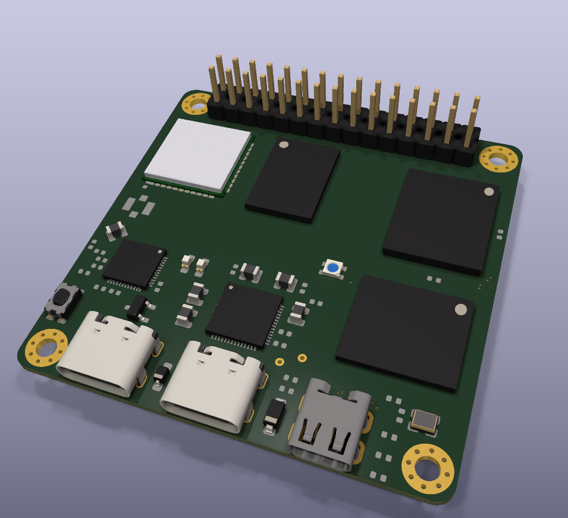
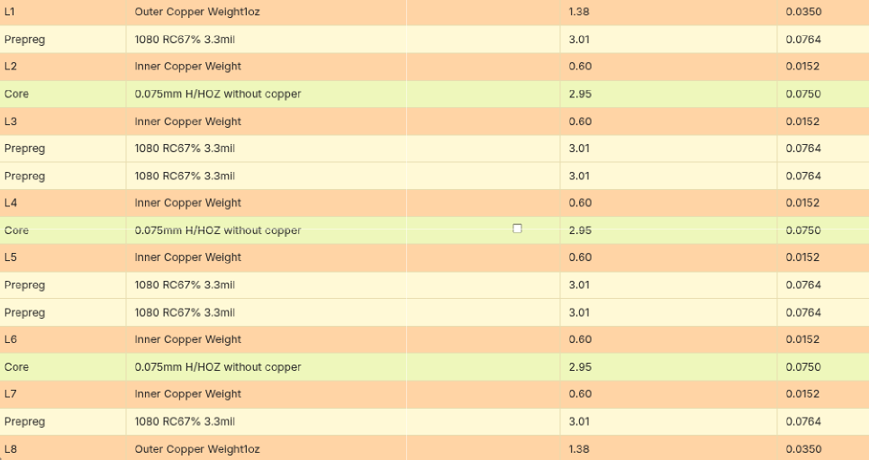
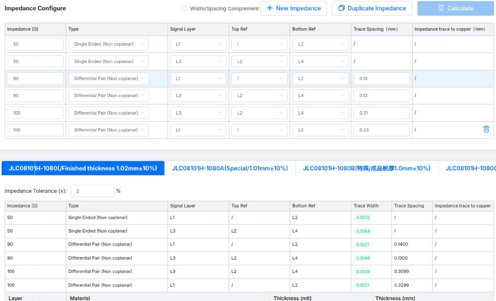
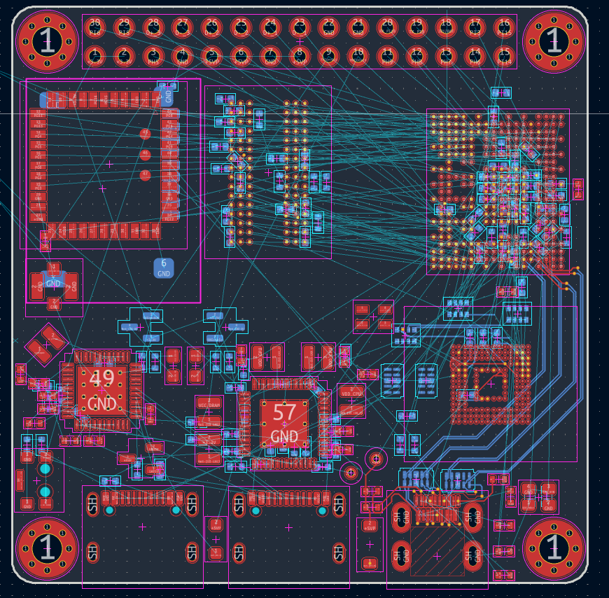

# Nebula Board (Allwinner H616 Devboard)

A compact, battery-powered 64-bit ARM development board measuring 50 mm × 50 mm based on the Allwinner H616 Quad-Core Cortex-A53 SoC with integrated powerbank PMU, high-speed DDR3, eMMC 5.1, and dual-band Wi-Fi.

Unlike standard commercial H616 boards (Orange Pi, Banana Pi, etc.) that require a 5V/3A wall adapter and shut down the moment you unplug the cable, Nebula Board features an onboard bidirectional fast-charging system that runs from a single Li-ion cell (18650 / Li-Po) and recharges via USB-C with USB-PD / QC4+.

# JLCPCB & LCSC
The main challenge with this 8-layer board is using an available stackup from JLCPCB as of August 29, 2026, I recommend [**JLC08101H-1080 (/Finished thickness 1.02 mm ±10%**.](https://jlcpcb.com/pcb-impedance-calculator)

Another challenge is that the via holes are 0.3 mm in size (0.35/0.45 mm). 
With these parameters, [JLCPCB](https://cart.jlcpcb.com/) allows you to manufacture the board for $2 USD. Any change will make the price astronomical.
For example, it is not recommended to change the **minimum via hole size/diameter.**
For via covering, I used “via in pad,” so the manufacturer does not allow the via to remain unfilled with epoxy. 
Dimensions up to 50 mm by 50 mm.
If you have the budget, I recommend simply assembling a board based on the original [Kononenko-K](https://github.com/Kononenko-K/Allwinner_H616_Devboard) design or redesigning my board, because there’s no point in doing this if you don’t want to order a PCB at a promotional price like I did—you’ll waste a lot of energy and may sacrifice stability.

PCB assembly, LCSC isn’t supported in Ukraine, of course, you can use a mail forwarding service, but I’m interested in soldering the board myself and buying parts cheaper on marketplaces—and that same **V3S** costs me practically nothing on the market. If you’re making a board for PCB assembly, it’s worth making it single-sided to save money, but the economical PCBA mode isn’t supported for BGA soldering, and it costs $25, so there’s no point in doing that.

### Layer Stackup Structure

* L1 (F.Cu): High-speed signals, RF 50 Ω, components (1 oz copper, 0.035 mm)
* L2 (In1.Cu): Continuous Ground Plane (GND) (0.5 oz copper, 0.0152 mm)
* L3 (In2.Cu): Inner signal routing — DDR3 striplines (0.5 oz copper, 0.0152 mm)
* L4 (In3.Cu): Ground / Power Plane (0.5 oz copper, 0.0152 mm)
* L5 (In4.Cu): Power Planes (VDD_CPU, VDD_GPU, +5V, +3.3V) (0.5 oz copper, 0.0152 mm)
* L6 (In5.Cu): Inner signal routing (0.5 oz copper, 0.0152 mm)
* L7 (In6.Cu): Continuous Ground Plane (GND) (0.5 oz copper, 0.0152 mm)
* L8 (B.Cu): Decoupling capacitors (0402 directly under BGA balls) & connectors (1 oz copper, 0.035 mm)

### Controlled Impedance

| Signal Group | Impedance | Layer | Trace Width | Spacing | Notes |
|:---|:---:|:---:|:---:|:---:|:---|
| RF / Single-Ended 50 Ω | 50 Ω | L1 (ref L2) | 0.107 mm | — | Wi-Fi 50 Ω line, eMMC, Clock |
| DDR3 Single-Ended 50 Ω | 50 Ω | L3 (ref L2/L4) | 0.106 mm | — | Inner stripline DDR3 DQ / Address |
| USB 2.0 Differential 90 Ω | 90 Ω | L1 (ref L2) | 0.102 mm | 0.140 mm | USB D+ / D- differential pairs |
| USB 2.0 Differential 90 Ω | 90 Ω | L3 (ref L2/L4) | 0.105 mm | 0.130 mm | Inner USB routing |
| HDMI / DDR Clock 100 Ω | 100 Ω | L1 (ref L2) | 0.102 mm | 0.330 mm | HDMI TMDS clock/data, DDR CK/DQS |
| HDMI / DDR Clock 100 Ω | 100 Ω | L3 (ref L2/L4) | 0.103 mm | 0.310 mm | Inner 100 Ω differential stripline |

## EDA

I’m screwing around with the layout because the DDR was really hard to route, and I lost all motivation working in KiCad—the wise will skip KiCad and download Altium, so think carefully about which software to use.

# RAM
My board has only one DDR3 chip, up to 1 GB, but if you’re looking for performance, two chips provide twice as much memory and twice the speed.

The H616 supports 16-bit or 32-bit DRAM memory interfaces. According to the JEDEC standard, a single discrete DDR3 chip is 16-bit wide, so a single-chip design uses a 16-bit interface. Compatible 96-ball FBGA chips include:

### SK Hynix  
* H5TQ1G63BFR (1 Gb / 128 MB)  
* H5TQ2G63BFR / H5TQ2G63DFR (2 Gb / 256 MB)  
* H5TQ4G63AFR / H5TQ4G63CFR / H5TQ4G63MFR (4 Gb / 512 MB)  
* H5TC8G63AMR / H5TC8G63CMR (8 Gb / 1 GB — low-voltage DDR3L)  
### Samsung  
* K4B1G1646G / K4B1G1646I (1 Gb / 128 MB)  
* K4B2G1646E / K4B2G1646F (2 Gb / 256 MB)  
* K4B4G1646D / K4B4G1646E (4 Gb / 512 MB)  
* K4B8G1646D / K4B8G1646B (8 Gb / 1 GB)  
### Micron  
* MT41J64M16 (1 Gb / 128 MB)  
* MT41J128M16 / MT41K128M16 (2 Gb / 256 MB)  
* MT41J256M16 / MT41K256M16 (4 Gb / 512 MB)  
* MT41J512M16 / MT41K512M16 (8 Gb / 1 GB)  
### Nanya  
* NT5CB64M16 (1 Gb / 128 MB)  
* NT5CB128M16 / NT5CC128M16 (2 Gb / 256 MB)  
* NT5CB256M16 / NT5CC256M16 (4 Gb / 512 MB)  
* NT5CC512M16 (8 Gb / 1 GB)

## Connection
For Wi-Fi/Bluetooth, I’d choose a board based on the **RTL8821CS** for better speed and so on, because Wi-Fi connects via GPIO (i.e., **SDIO**) and Bluetooth via **UART**. But since there are 3 free USB channels, I’ll connect an **RTL8821CU** board to them for a simple USB connection. Feel free to use any other wireless module that suits your needs; **5 (5.8) GHz** support is important to me, which is why I chose the RTL8821CU, but I recommend taking a closer look at Broadcom options (like AP6256). An IPEX/U.FL connector is used on the board for connecting an external antenna.

## Power (AXP305 + SW6206)
Since I’m planning for standalone operation, and the PMIC **AXP305** wasn’t designed for that—only for monotonous operation from a power supply in TV set-top boxes—it doesn’t support a battery, and there’s certainly no datasheet for it. According to the developer, we’re supposed to use only the reference design together with the **H616**—so be it.

The board features a dual-PMIC architecture:

**SW6206 (Battery & Fast Charger):**
* Acts as a full-featured powerbank controller supporting PD 3.0, QC 4+, AFC, FCP, and PPS up to 22.5 W.
* Regulates 1S Li-ion charging (set to 4.20 V via FLED/BSET 10k resistor).
* Features a hardware 5 mΩ Kelvin-sense resistor (VOUTSP/VOUTSN) and synchronous buck-boost converter.
* Generates a stable +5V system rail (+5VP_0) for the board whether running from an external wall charger or boosting from battery.
* Controlled over I2C (slave address 0x3C) by H616.

**AXP305 (System PMIC):**
* Takes the +5VP_0 rail and steps it down via multiple high-efficiency DCDC buck converters:
  * DCDC A/B: VDD_CPU (dynamically scaled for Cortex-A53 DVFS, ~0.9V–1.1V).
  * DCDC C: VDD_GPU.
  * DCDC D: VCC_DRAM (1.50 V for DDR3).
  * DCDC E: VCC_SYS / IO (3.30 V).
  * ALDO1 / BLDO / CLDO: Low-noise LDO rails for PLLs, eMMC IO (1.80 V), and analog audio.

**Dual USB-C Topology:**
* **Port J4 (Power/Charge):** Connected to SW6206. Used to charge the battery or power the board with fast-charging adapters.
* **Port J3 (USB OTG / Data):** Connected directly to the Allwinner H616 USB OTG controller (D+/D-) with 5.1k CC pull-downs and Schottky diode power protection to +5VP_0. Allows flashing, ADB, Linux gadget networking, or USB host mode while on battery.

# Flux & Paste
For *double-sided soldering*, I recommend purchasing solder pastes: low-temperature (bismuth-based, **~138°C**) and medium-/high-temperature (lead-based, **~183°C**, or lead-free, **~217°C**).

**MECHANIC V5B45** Sn42/Bi58 Solder Paste: Composition and Temperature: Tin-bismuth alloy (Sn42/Bi58) with a precise melting point of **138°C**. For the top side of **BGAs**.

**BS458** Mechanic Solder Paste: Features: A low-melting-point, lead-free, RoHS-compliant formulation supplied in convenient jars. For the back side, resistors, and capacitors.

# Documentation & Soldering WARNING!!!
[***This***](https://csbible.com/wp-content/uploads/2018/03/CSB_Pew_Bible_2nd_Printing.pdf)

 
  

